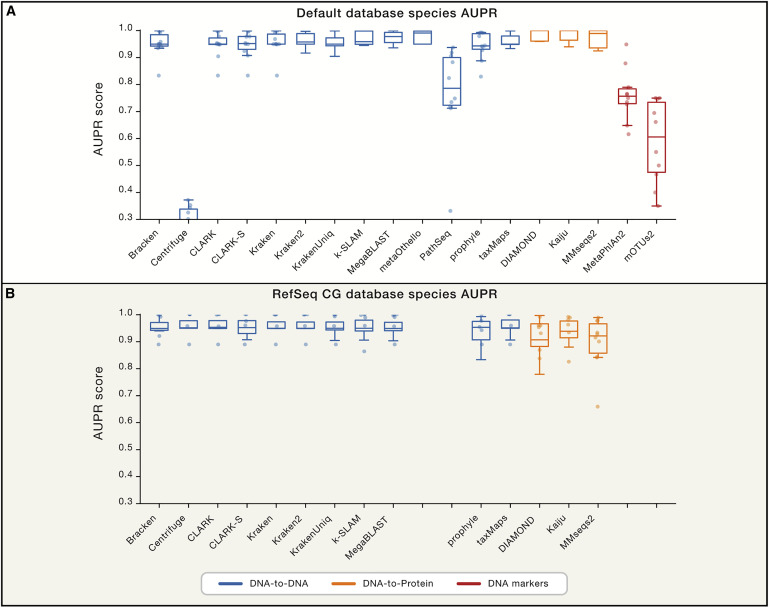
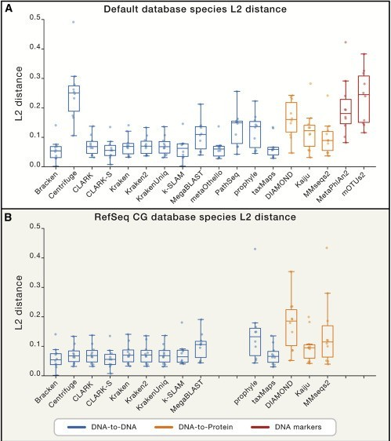
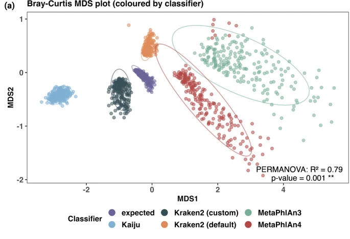

<!-- Custom title with logo -->
<div class="title-container">
  
</div>


```{=html}
<style>

.textbox {
  border: 1px solid #ccc;
  padding: 10px;
  background-color: #f5f5f5;
}

.highlight {
  background-color: yellow;
  font-weight: bold;
}
</style>
```


# Introduction

The first question to answer in a metagenomics study is **who is there?** It is to identify the members of the microbial community. There are two
approaches that could be used to achieve this goal: the first is to utilize the reads and the other is to assemble the metagenomes before using
homology search to the database. We will look at the read based approach in this section. There are three main algorithms to classify the reads to
taxa: the first is to do homology search (for example, using blast: MEGAN) of the reads against huge reference databases, the second is k-mer based
and the third is marker gene based. In this step, we are going to focus on the k-mer based classification usually more accurate and faster to compute.





[Reference](https://doi.org/10.1016/j.cell.2019.07.010)

 [Reference](https://doi.org/10.1186/s40793-024-00561-w)

# Taxonomy profiling using Kraken2 & Bracken abundance estimation

K-mer based methods count the k-mer frequency of the reads, and compare it to a model trained with sequences from known genomes. There are a few tools
belong to this group of method: Kraken, Centrifuge, Kraken2, Clark, Kaiju. For the Read based analyses we will use
[Kraken2](https://doi.org/10.1186/s13059-019-1891-0).

## Download the database for Kraken2 and Bracken

In order to run Kraken2, one has to build corresponding database first, the command to build the standard Kraken2 database is kraken2-build –standard
–threads 24 –db kraken.db. This will download NCBI taxonomic information, as well as the complete genomes in RefSeq for the bacterial, archaeal, and
viral domains, along with the human genome and a collection of known vectors (UniVec_Core). The build process is the most time-consuming, so we are
not going to perform it in this workshop. We will link to prebuild databases are [here](https://benlangmead.github.io/aws-indexes/k2).

Silva version 138:

```{bash,eval=F}
wget https://genome-idx.s3.amazonaws.com/kraken/16S_Silva132_20200326.tgz
```

## Kraken2 classification

The Kraken sequence classification algorithm. To classify a sequence, each k-mer in the sequence is mapped to the lowest common ancestor (LCA) of the
genomes that contain that k-mer in a database. The taxa associated with the sequence’s k-mers, as well as the taxa’s ancestors, form a pruned subtree
of the general taxonomy tree, which is used for classification. In the classification tree, each node has a weight equal to the number of k-mers in
the sequence associated with the node’s taxon. Each root-to-leaf (RTL) path in the classification tree is scored by adding all weights in the path,
and the maximal RTL path in the classification tree is the classification path (nodes highlighted in yellow). The leaf of this classification path
(the orange, leftmost leaf in the classification tree) is the classification used for the query sequence.


```{bash, eval=F}
cd /home/vincent/Documents/metagenomics_conakry/data/fastq

# Store filenames in an array
filenames=$(*.fastq)

SAMPLES=()
for f in "${filenames[@]}"; do
  SAMPLES+=("$(echo "$f" | sed 's/_R[0-9]\+_001\.fastq.gz//')")
done

# Ensure unique samples
SAMPLES=($(echo "${SAMPLES[@]}" | tr " " "\n" | sort -u | tr "\n" " "))

# Print the unique samples
echo "${SAMPLES[@]}"
```

```{bash, eval=F}
# Create directory for each sample
mkdir -p /home/vincent/Documents/metagenomics_conakry/data/fastq/kraken
  
# Create Kraken output directories and run Kraken2 for each sample
for SAMPLE in "${SAMPLES[@]}"; do
  
  # Run Kraken2 for each sample
  kraken2 --db ~/Documents/metagenomics_conakry/data/16S_Silva138_20200326/16S_SILVA138_k2db \
          --threads 16 \
          --output ./kraken/"$SAMPLE".kraken.out \
          --report ./kraken/"$SAMPLE".kraken_report.out \
          --paired /home/vincent/Documents/metagenomics_conakry/data/fastq/TRIMMED/"$SAMPLE".R1.fastq.gz /home/vincent/Documents/metagenomics_conakry/data/fastq/TRIMMED/"$SAMPLE".R2.fastq.gz
done
```

55.61 309467 309467 U 0 unclassified 44.39 247036 3216 - 1 root 41.33 230018 0 - 131567 cellular organisms 41.33 230016 2863 D 2 Bacteria 40.76 226815
4 - 1783272 Terrabacteria group 40.76 226807 10 P 1239 Firmicutes 40.75 226797 190 C 91061 Bacilli 40.72 226600 299 O 1385 Bacillales 40.66 226294 6 F
186817 Bacillaceae 40.66 226284 10863 G 1386 Bacillus 38.71 215396 170433 - 86661 Bacillus cereus group 7.76 43168 43129 S 1392 Bacillus anthracis
0.00 24 24 - 568206 Bacillus anthracis str. CDC 684 0.00 5 5 - 768494 Bacillus anthracis str. H9401 0.00 3 3 - 261591 Bacillus anthracis str. Vollum
0.00 3 3 - 1452727 Bacillus anthracis str. Turkey32 0.00 2 2 - 1412844 Bacillus anthracis 52-G 0.00 1 1 - 198094 Bacillus anthracis str. Ames 0.00 1
1 - 1412843 Bacillus anthracis 8903-G 0.22 1221 513 S 1396 Bacillus cereus 0.02 91 91 - 526968 Bacillus cereus R309803

1.  Percentage of reads covered by the clade rooted at this taxon
2.  Number of reads covered by the clade rooted at this taxon
3.  Number of reads assigned directly to this taxon
4.  A taxonomy rank code
5.  NCBI taxonomy ID
6.  indented scientific name

## Bracken abundance estimation

What Kraken2 has produced is the classification of each read to a taxonomic rank. This result needs to be further refined to generate species (genus,
phylum) level abundance table for downstream statistical analysis. This process needs to be done properly. Kraken2 only classifies the reads to the
Lowest Common Ancestor (LCA) because there are many genomes present in the database have large fractions of their sequences identical to other
genomes. This leads to the result that for well-populated clades with low genome diversity, Kraken only reports species-level assignments for reads
from unique regions, while for many species the majority of reads might be classified at a higher level of the taxonomy and the number of reads
classified directly to a species may be far lower than the actual number present. Therefore, Kraken’s raw read assignments cannot be directly
translated into species- or strain-level abundance estimates. Bracken has been designed to perform sophisticated probabilistically re-distribution of
reads to estimate the abundance.

[Bracken](https://github.com/jenniferlu717/Bracken) takes the output from Kraken and estimate the abundance at user specified level: species, genus,
or phylum.

### Install bracken

```{bash, eval=F}
git clone https://github.com/jenniferlu717/Bracken.git
cd Bracken
bash install_bracken.sh
cd ../
```

### Run Bracken

```{bash, eval=F}
# Create a main directory for Kraken and Bracken outputs
mkdir -p /home/vincent/Documents/metagenomics_conakry/data/fastq/kraken/bracken

# Run Bracken for each sample
for SAMPLE in "${SAMPLES[@]}"; do
  # Run Bracken for each sample's Kraken report
  ~/Bracken/bracken -d ~/Documents/metagenomics_conakry/data/16S_Silva138_20200326/16S_SILVA138_k2db \
                  -t 16 -l G \
                  -i ./kraken/"$SAMPLE".kraken_report.out \
                  -o ./kraken/bracken/"$SAMPLE"_species.bracken
done
```

NOTE: two sample have little information, they are discarded: - **Gl-114_S44** - **I18_S72**

### Convert to a biom file

This step runs very fast, a few seconds. It generates two files for each sample in its corresponding subdirectory inside BRACKEN:
samplename_report_species.txt and samplename.kraken_report_bracken.out. Please take a look at both files to understand what they contain.

Finally, we are converting the backen report into biom file for the downstrem analysis.

```{bash, eval=F}
kraken-biom *.kraken_report_bracken_genuses.out -o bracken/merge_species.biom --fmt json -v
```
