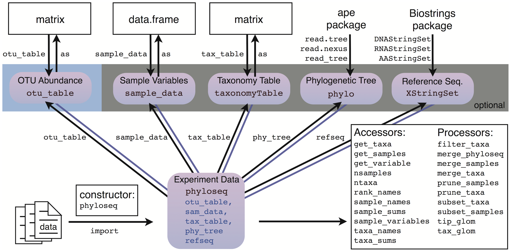

<!-- Custom title with logo -->
<div class="title-container">
  
</div>


```{=html}
<style>

.textbox {
  border: 1px solid #ccc;
  padding: 10px;
  background-color: #f5f5f5;
}

.highlight {
  background-color: yellow;
  font-weight: bold;
}
</style>
```


# Introduction

These exercises are meant to show how to conceptually approach your data analysis but there are many more and different ways to explore your data. The most important thing to keep in mind is that you have to understand your own data and analyses. One way to achieve this is to perform visual explorations that help you to judge whether the data are appropriate for your question.

Now let’s start the fun!

In R studio.


# Load libraries - working environnement

## Packages for data manipulation and wrangling

```{r lib1}
# dplyr: A grammar of data manipulation, providing a consistent set of verbs to solve common data manipulation challenges
library(dplyr)

# tibble: Provides a modern re-imagining of data frames, making them more user-friendly
library(tibble)

# tidyverse: A collection of R packages designed for data science, all sharing an underlying design philosophy, grammar, and data structures
library(tidyverse)
```


## Packages for microbiome analysis

```{r lib2}
# microbiome: Provides tools for microbiome data analysis and visualization
library(microbiome)

# microbiome utilities: Extends functionalities of the microbiome package with additional utilities
library(microbiomeutilities)

# phyloseq: Microbiome Analysis, provides functionalities for microbiome data analysis and visualization
library(phyloseq)
```

## Packages for data visualization

```{r lib3}
# ggplot2: A system for creating elegant and versatile data visualizations based on the grammar of graphics
library(ggplot2)

# hrbrthemes: Contains additional themes, theme components, and utilities for ggplot2
library(hrbrthemes)

# RColorBrewer: Provides color palettes for visualizing data, particularly useful in ggplot2 visualizations
library(RColorBrewer)
```

# Load the data

First we need to load our data. Usually the biggest bottleneck between raw data and analyses is to get the data in the right shape for your purpose. Often this requires a little bit of data mingling. On this road - Google is your best friend to master the R universe :)

Let’s first load the relative abundance table.

For this part we are using the [phyloseq](https://joey711.github.io/phyloseq/) package. The phyloseq package is a tool to import, store, analyze, and graphically display complex phylogenetic sequencing data that has already been clustered into Operational Taxonomic Units (OTUs), especially when there is associated sample data, phylogenetic tree, and/or taxonomic assignment of the OTUs.

First st your working directory:

```{r wd}
setwd("../Day_2/")
```


And load your two files:

```{r data}
merged_biom_samples <- phyloseq::import_biom("../data/fastq/kraken/bracken/merge_species.biom") 
merged_metagenomes <- merged_biom_samples
meta <- readxl::read_excel("../data/Glossina_metadata.xlsx")
```


## Phyloseq-ize Data

Any data already in an R session can be annotated/coerced to be recognized by phyloseq’s functions and methods. This is important, because there are lots of ways you might receive data related to a microbiome project, and not all of these will come from a popular server or workflow that is already supported by a phyloseq import function.



-   **otu_table** - Works on any numeric matrix. You must also specify if the species are rows or columns
-   **tax_table** - Works on any character matrix. The row names must match the OTU names (taxa_names) of the otu_table if you plan to combine it with a phyloseq-object.
-   **sample_data** - Works on any data.frame. The row names must match the sample names in the otu_table if you plan to combine them as a phyloseq-object

Let's look at the phlyseq object.

```{r dat1}
merged_biom_samples
```

## Summarize the data.

```{r dat2}
# Summarize the phyloseq object 'merged_biom_samples'
#microbiome::summarize_phyloseq(merged_biom_samples)

# Display the first few rows of the OTU (Operational Taxonomic Unit) table
head(otu_table(merged_biom_samples))

# Display the first few rows of the taxonomy table
head(tax_table(merged_biom_samples))

# Display the first few rows of the sample data associated with 'merged_biom_samples'
#head(sample_data(merged_biom_samples))

# Get the sample variables of the phyloseq object 'merged_biom_samples'
#sample_variables(merged_biom_samples)
```

We need to add the metadata to the phyloseq object.

## Format the data

```{r dat3}
# Set the new column names in the phyloseq object
sample_names(merged_metagenomes) <- gsub("_.*$|\\.kraken_report_bracken_genuses$", "", sample_names(merged_metagenomes))
sample_names(merged_metagenomes) <- gsub("^Gl", "GI", sample_names(merged_metagenomes))
# Sort the 'meta' data frame by the 'SRA.identifier' column
meta$Sample <- gsub("_.*$", "", meta$Sample)
meta$Samples <- meta$Sample
meta <- meta %>% column_to_rownames(var = "Samples")

# meta$Sample == sample_names(merged_metagenomes)

# Associate the sorted metadata to the phyloseq object as sample data
merged_metagenomes@sam_data <- sample_data(meta)

# Remove the unnecessary 'k_' prefix in the taxonomy data
merged_metagenomes@tax_table@.Data <- substring(merged_metagenomes@tax_table@.Data, 4)

# Rename the columns of the taxonomy table to represent taxonomic ranks
colnames(merged_metagenomes@tax_table@.Data) <- c("Kingdom", "Phylum", "Class", "Order", "Family", "Genus", "Species")
```

## Basic stats

Before we start anything, let’s just check out or data a little bit (sanity check). Never go blind into your analyses.

```{r dat4}
head(psmelt(merged_metagenomes))
```

</details>

**Q: How many species and samples are detected in our data set?**

<details>

<summary>HINT</summary>

> ntaxa(merged_metagenomes), nsamples.

</details>

**Q: Look at the taxonomy is there some problem with the taxonomy?**

<details>

<summary>HINT</summary>

> We have contaminant in the data. Which one? (head(psmelt(merged_metagenomes)))

</details>

**Q: what are the taxa with the more abundant reads?**

<details>

<summary>HINT</summary>

> head(otu_table(merged_metagenomes))

</details>

Extraction of the sample's names.

```{r dat5}
sample_names(merged_metagenomes)
```

## Aggregation

Microbial species can be called at multiple taxonomic resolutions. We can easily agglomerate the data based on taxonomic ranks. Here, we agglomerate the data at Genus level.

```{r dat16}
level <- "Genus"
merged_metagenomes_taxfull <- merged_metagenomes
# Aggregate rare taxa at the family level for the phyloseq object 'merged_metagenomes'
merged_metagenomes <- aggregate_rare(merged_metagenomes, level = level, detection = 0/100, prevalence = 0/100)

tax_table_df <- as.data.frame(merged_metagenomes@tax_table)
otus_to_keep <- rownames(tax_table_df[tax_table_df$Genus != "Other", ])
merged_metagenomes <- prune_taxa(otus_to_keep, merged_metagenomes)

# Display the dimensionality of the abundances of 'merged_metagenomes_family'
dim(abundances(merged_metagenomes))
```

**Q: How many sample and tax do we have now?**

<details>

<summary>HINT</summary>

> There are XX taxa and 80 samples, meaning that there are XX different Phylum level taxonomic groups. Looking at the rowData after agglomeration shows all Enterococcaceae are combined together, and all lower rank information is lost.

```{r dat7}
head(tax_table(merged_metagenomes))
```

</details>

# QC and Pre-process data

Now that we know a little bit about our data we can start the pre-processing.

## Library size / read count

Let us check for distribution of number of sequences retained from the Kraken/Bracken approach.

```{r plot}
plot_read_distribution(merged_metagenomes, "sex", plot.type = "density")
```

*You can try to plot with different metadata.*

Plotting the read count per sample

```{r plot2}
df <- psmelt(merged_metagenomes)  %>%  group_by(Sample, sex) %>%  
  summarise(sum_reads = sum(Abundance)) %>% arrange(sum_reads) 

ggplot(df) +
  geom_bar(aes(reorder(Sample, -sum_reads), sum_reads, fill=sex),
           col="red", alpha = .7, stat="identity") 
```
**Q: What do observe, what will be the consequences**

## Contaminant and filtering targeted data

Samples might be contaminated with exogenous sequences. We have observed 1 contaminants Homo sapiens.

```{r psmelt}
#check 

head(psmelt(subset_taxa(merged_metagenomes, Genus == "Trypanosoma")))

#Keep only the kingdom of interest
merged_metagenomes <- subset_taxa(merged_metagenomes_taxfull, Kingdom =="Bacteria")
merged_metagenomes <- aggregate_rare(merged_metagenomes, level = level, detection = 0/100, prevalence = 0/100)

tax_table_df <- as.data.frame(merged_metagenomes@tax_table)
otus_to_keep <- rownames(tax_table_df[tax_table_df$Genus != "Other", ])
merged_metagenomes <- prune_taxa(otus_to_keep, merged_metagenomes)

```


## Microbiome composition

Microbial abundances are typically ‘compositional’ (relative) in the current microbiome profiling data sets. This is due to technical aspects of the data generation process (see e.g. Gloor et al., 2017).

The next example calculates relative abundances as these are usually easier to interpret than plain counts. For some statistical models we need to transform the data into other formats as explained in above link (and as we will see later).

*detection*: Detection threshold for absence/presence (percentage reads). *prevalence*: Prevalence threshold (in [0, 1]) (presence across samples).

```{r aggre}

pseq <- microbiome::transform(merged_metagenomes, transform = "compositional")

```

**Q: what is the meaning and effect of compositional?**

<details>

<summary>HINT</summary>

> abundances(pseq)

</details>


## Visualization

**Bar plot** are useful to have a broad look at the data.

```{r plot3, eval=T}
pseq <- microbiome::transform(merged_metagenomes, transform = "compositional")

# Create a plot of the taxonomic composition at the level selected
p <- plot_composition(pseq,
                      taxonomic.level = "Genus", # Specify the taxonomic level for the plot
                      sample.sort = "Sample",     # Sort samples by sample identifier
                      x.label = "Sample",         # Label for the x-axis
                      group_by = "sex") +          # Group samples by the 'Time' variable

  # Use a color palette from the Color Brewer for filling the Family groups
  #scale_fill_brewer("Species", palette = "magma-viridis") +

  # Arrange the legend items in a single column
  guides(fill = guide_legend(ncol = 1)) +

  # Convert the y-axis to represent relative abundance as a percentage
  scale_y_percent() +

  # Add labels and a title to the plot
  labs(x = "Samples", y = "Relative abundance (%)",
       title = "Relative abundance data - Full dataset") + 

  # Apply a clean theme with a horizontal grid
  theme_ipsum(grid = "Y") +

  # Customize the theme for x-axis text and legend text
  theme(axis.text.x = element_text(angle = 90, hjust = 1), # Rotate x-axis text 90 degrees for readability
        legend.text = element_text(face = "italic"),    # Italicize the legend text
        legend.position = "right")

# Print the plot
print(p)
 
```


**Q: Does the profiles look similar between samples? Can you spot any trends?**

<details>

<summary>HINT</summary>

> A: We see that the same one or two OTU dominates all samples but there is some variability between samples. And ?

</details>

*If you have time you can also visualize the other taxonomic levels (e.g. species) with the same approach. Try to come up with the code yourself.*

```{r plot4, eval=T}

n <- dim(tax_table(pseq))[1]
qual_col_pals = brewer.pal.info[brewer.pal.info$category == 'qual',]
col_vector = unlist(mapply(brewer.pal, qual_col_pals$maxcolors, rownames(qual_col_pals)))
col_vector <- rep(col_vector, length.out = 84)
# Create a plot of the taxonomic composition at the Genus level
p <- plot_composition(pseq,
                      taxonomic.level = "Phylum", # Specify the taxonomic level for the plot
                      sample.sort = "Sample",    # Sort samples by sample identifier
                      x.label = "Sample",        # Label for the x-axis
                      otu.sort = "abundance",    # Sort OTUs by their abundance
                      group_by = "sex") +       # Group samples by the 'Type' variable

  # Use a color palette from the Color Brewer for filling the Genus groups
  scale_fill_manual(values = col_vector) +

  # Arrange the legend items in a single column
  guides(fill = guide_legend(ncol = 1)) +

  # Convert the y-axis to represent relative abundance as a percentage
  scale_y_percent() +

  # Add labels and a title to the plot
  labs(x = "Samples", y = "Relative abundance (%)",
       title = "Relative abundance data") + 

  # Apply a clean theme with a horizontal grid
  theme_ipsum(grid = "Y") +

  # Customize the theme for x-axis text and legend text
  theme(axis.text.x = element_text(angle = 90, hjust = 1), # Rotate x-axis text 90 degrees for readability
        legend.text = element_text(face = "italic"))       # Italicize the legend text

# Print the plot
print(p)
```


**What do you Observe? Is it correct? What action should be taken?**

# Final figures

## Run rarefaction curves

Before normalization by sub-sampling, let’s have a look at rarefaction curves, evaluate your sequencing effort and make decisions. Rarefaction is a statistical technique employed to evaluate species richness based on sampling results. The process involved sub-sampling reads without replacement to a defined sequencing depth, thereby creating a standardized library size across samples. Any sample with a total read count less than the defined sequencing depth used to rarefy will be discarded. What we want to see in those curves is that it reaches a plateau meaning no new OTUs are discovered (going up on the Y axis) as sequencing is deeper (the X axis). If this happens we can be pretty confident that we sequenced all the OTUs that were present in the sample.

```{r rare1, eval=F}
install.packages("remotes")
remotes::install_github("gauravsk/ranacapa")
```

```{r rare2, eval=T}
# Define the list of samples to remove
samples_to_remove <- c("GI-103", "GI-59", "GI-104", "GI-111", "GI-121", 
                       "GI-124", "GI-125", "GI-14", "GI-15", "GI-16", 
                       "GI-17", "GI-25", "GI-26", "GI-27", "GI-28", 
                       "GI-29", "GI-30", "GI-31", "GI-32", "GI-33", 
                       "GI-34", "GI-36", "GI-38", "GI-39", "GI-45", "GI-47", "GI-51", "I9", "I7")

# Prune these samples from your phyloseq object
physeq_cleaned <- prune_samples(!(sample_names(merged_metagenomes) %in% samples_to_remove), merged_metagenomes)


ranacapa::ggrare(physeq_cleaned, step = 10, color = "Sample", se = FALSE) +
    geom_vline(xintercept = min(sample_sums(pseq)), color = "gray60")
```

***Q: What do you observe?***

## Relative abundance (%) - Reduced dataset

```{r plot5, eval=T}
pseq <- microbiome::transform(physeq_cleaned, transform = "compositional")

n <- dim(tax_table(pseq))[1]
qual_col_pals = brewer.pal.info[brewer.pal.info$category == 'qual',]
col_vector = unlist(mapply(brewer.pal, qual_col_pals$maxcolors, rownames(qual_col_pals)))
col_vector <- rep(col_vector, length.out = 84)
# Create a plot of the taxonomic composition at the Genus level
p <- plot_composition(pseq,
                      taxonomic.level = "Phylum", # Specify the taxonomic level for the plot
                      sample.sort = "Sample",    # Sort samples by sample identifier
                      x.label = "Sample",        # Label for the x-axis
                      otu.sort = "abundance",    # Sort OTUs by their abundance
                      group_by = "sex") +       # Group samples by the 'Type' variable

  # Use a color palette from the Color Brewer for filling the Genus groups
  scale_fill_manual(values = col_vector) +

  # Arrange the legend items in a single column
  guides(fill = guide_legend(ncol = 1)) +

  # Convert the y-axis to represent relative abundance as a percentage
  scale_y_percent() +

  # Add labels and a title to the plot
  labs(x = "Samples", y = "Relative abundance (%)",
       title = "Relative abundance - Reduced dataset") + 

  # Apply a clean theme with a horizontal grid
  theme_ipsum(grid = "Y") +
  # Customize the theme for x-axis text and legend text
  theme(axis.text.x = element_text(angle = 90, hjust = 1), # Rotate x-axis text 90 degrees for readability
  legend.text = element_text(face = "italic"))       # Italicize the legend text

# Print the plot
print(p)
```