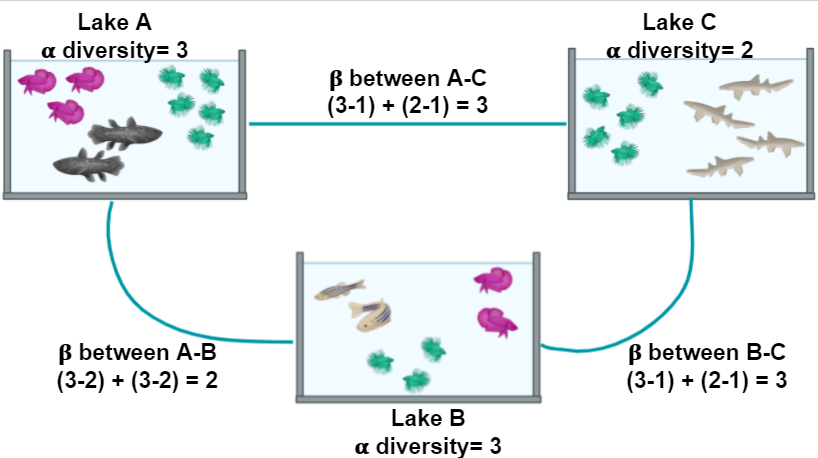

```{=html}
<style>

.textbox {
  border: 1px solid #ccc;
  padding: 10px;
  background-color: #f5f5f5;
}

.highlight {
  background-color: yellow;
  font-weight: bold;
}
</style>
```

<!-- Custom title with logo -->
<div class="title-container">
  
</div>

# Diversity indices Introduction

Species diversity, in its simplest definition, is the number of species in a particular area and their relative abundance (evenness). Once we know the
taxonomic composition of our metagenomes, we can do diversity analyses. Here we will discuss the two most used diversity metrics, α diversity (within
one metagenome) and β (across metagenomes).

-   *α* Diversity: Can be represented only as richness (, i.e., the number of different species in an environment), or it can be measured considering
    the abundance of the species in the environment as well (i.e., the number of individuals of each species inside the environment). To measure
    α-diversity, we use indexes such as Shannon’s, Simpson’s, Chao1, etc.


*Alpha diversity is calculated according to fish diversity in a pond. Here, alpha diversity is represented in its simplest way: Richness.*

In the next example, we will look at the α and the β components of the diversity of a dataset of fishes in three lakes. The most simple way to
calculate the β-diversity is to calculate the distinct species between two lakes (sites). Let us take as an example the diversity between Lake A and
Lake B. The number of species in Lake A is 3. To this quantity, we will subtract the number of these species that are shared with the Lake B: 2. So
the number of unique species in Lake A compared to Lake B is (3-2) = 1. To this number, we will sum the result of the same operations but now take
Lake B as our reference site. In the end, the β diversity between Lake A and Lake B is (3-2) + (3-2) = 2. This process can be repeated, taking each
pair of lakes as the focused sites.

 *Alpha and beta diversity indexes of fishes in a pond.*

-   *β* diversity mesures how different two or more communities are, either in their composition (richness) or in the abundance of the organisms that
    compose it (abundance).

-   *Bray-Curtis dissimilarity*: The difference in richness and abundance across environments (samples). Weight on abundance. Measures the differences
    from 0 (equal communities) to 1 (different communities)

-   *Jaccard distance*: Based on the presence/absence of species (diversity). It goes from 0 (same species in the community) to 1 (no species in
    common)

-   *UniFrac*: Measures the phylogenetic distance; how alike the trees in each community are. There are two types, without weights (diversity) and
    with weights (diversity and abundance) There are different ways to plot and show the results of such analysis. Among others, PCA, PCoA, or NMDS
    analysis are widely used.


**Q: Which of the options below is true for the alpha diversity in lakes A, B, and beta diversity between lakes A and B, respectively?**

-   4, 3, 1
-   4, 3, 5
-   9, 7, 16

<details>

<summary>HINT</summary>

> 4, 3, 5 Alpha diversity in this case, is the sum of different species. Lake A has 4 different species and lake B has 3 different species. Beta
> diversity refers to the difference between lake A and lake B. If we use the formula in Figure 2 we can see that to calculate beta diversity, we have
> to detect the number of species and the number of shared species in both lakes. There is only one shared species, so we have to subtract the number
> of shared species to the total species and sum the result. In this case, in lake A, we have 4 different species and one shared species with lake B
> (4-1)=3, and in lake B we have three species and one shared species with lake A (3-1)=2. If we add 3+2, the result is 5.

</details>

# Loading the packages and Data

## Packages
  
```{r}
library(dplyr)
library(tibble)
library(microbiome)
library(vegan)
```

## load the data

```{r data}
merged_metagenomes <- phyloseq::import_biom("../data/fastq/kraken/bracken//merge_species.biom")
meta <- readxl::read_excel("../data/Glossina_metadata.xlsx")

# Set the new column names in the phyloseq object
sample_names(merged_metagenomes) <- gsub("_.*$|\\.kraken_report_bracken_genuses$", "", sample_names(merged_metagenomes))
sample_names(merged_metagenomes) <- gsub("^Gl", "GI", sample_names(merged_metagenomes))
# Sort the 'meta' data frame by the 'SRA.identifier' column
meta$Sample <- gsub("_.*$", "", meta$Sample)
meta$Samples <- meta$Sample
meta <- meta %>% column_to_rownames(var = "Samples")

# meta$Sample == sample_names(merged_metagenomes)

# Associate the sorted metadata to the phyloseq object as sample data
merged_metagenomes@sam_data <- sample_data(meta)

# Remove the unnecessary 'k_' prefix in the taxonomy data
merged_metagenomes@tax_table@.Data <- substring(merged_metagenomes@tax_table@.Data, 4)

# Rename the columns of the taxonomy table to represent taxonomic ranks
colnames(merged_metagenomes@tax_table@.Data) <- c("Kingdom", "Phylum", "Class", "Order", "Family", "Genus", "Species")

#Keep only the kingdom of interest
merged_metagenomes <- subset_taxa(merged_metagenomes, Kingdom =="Bacteria")
# head(sample_data(merged_metagenomes))
# head(tax_table(merged_metagenomes))
physeq <- microbiome::aggregate_rare(merged_metagenomes, level = "Genus", detection = 0.01/100, prevalence = 5/100)
# Define the list of samples to remove
samples_to_remove <- c("GI-103", "GI-59", "GI-104", "GI-111", "GI-121", 
                       "GI-124", "GI-125", "GI-14", "GI-15", "GI-16", 
                       "GI-17", "GI-25", "GI-26", "GI-27", "GI-28", 
                       "GI-29", "GI-30", "GI-31", "GI-32", "GI-33", 
                       "GI-34", "GI-36", "GI-38", "GI-39", "GI-45", "GI-47", "GI-51", "I9", "I7")

# Prune these samples from your phyloseq object
physeq <- prune_samples(!(sample_names(physeq) %in% samples_to_remove), physeq)


tax_table_df <- as.data.frame(physeq@tax_table)
otus_to_keep <- rownames(tax_table_df[tax_table_df$Genus != "Other", ])
physeq <- prune_taxa(otus_to_keep, physeq)
```


### sanity check

```{r, eval=FALSE}
# Identify OTUs with zero counts
empty_otus <- taxa_names(physeq)[taxa_sums(physeq) == 0]

# Print the empty OTU names
if (length(empty_otus) > 0) {
  print(paste("Empty OTUs:", paste(empty_otus, collapse = ", ")))
} else {
  print("No empty OTUs.")
}

# Identify samples with zero counts
empty_samples <- sample_names(physeq)[sample_sums(physeq) == 0]

# Print the empty sample names
if (length(empty_samples) > 0) {
    print(paste("Empty samples:", paste(empty_samples, collapse = ", ")))
} else {
    print("No empty samples.")
}
```


```{r}
# # Remove samples with no counts
# physeq_F <- prune_samples(sample_sums(physeq) > 0, physeq)
# # Remove OTUs with no counts
physeq <- prune_taxa(taxa_sums(physeq) > 0, physeq)
pseq <- physeq
```

# Alpha diversity indices

A comprehensive list of global indicators of the ecosystem state can be obtained as follows. This includes various measures of richness, evenness,
diversity, dominance, and rarity with default parameters. See the individual functions for more options regarding parameter tuning.


```{r tab}

# Calculate the Shannon diversity index for the aggregated phyloseq object 'pseq'
# The Shannon index measures the diversity within a sample, considering both richness and evenness
tab <- microbiome::alpha(pseq, index = 'shannon')

# Display the first few rows of the calculated Shannon diversity index table
head(tab)
```

This returns observed richness with given detection threshold(s).

```{r rich}
# Calculate the richness of the phyloseq object 'pseq' with a detection threshold of 1000
# Richness is a measure of the number of different taxa present in a sample
tab <- richness(pseq, detection = 1000)

# Display the first few rows of the calculated richness table
head(tab)
```

```{r shannon1, eval=T}
sample_data(pseq)$infection <- as.factor(sample_data(pseq)$infection)
p.shannon_infection <- boxplot_alpha(pseq, 
                           index = "shannon",
                           x_var = "infection",
                          fill.colors = c("not infected"="#2A9D8F", "infected"="#E76F51" ))
p.shannon_infection
```

```{r shannon, eval=T}
p.shannon_sex <- boxplot_alpha(pseq, 
                           index = "shannon",
                           x_var = "sex",
                          fill.colors = c(F="deeppink4",M="darkorange1" ))
p.shannon_sex
```

```{r shannon2, eval=T}
colnames(sample_data(pseq))[colnames(sample_data(pseq)) == "Ecological gradient"] <- "Ecological.gradient"
p.shannon_Ecological_gradient <- boxplot_alpha(pseq, 
                           index = "shannon",
                           x_var = "Ecological.gradient",
                          fill.colors = c("wild"="#264653","ecotone"="#2A9D8F", "farmed land" = "#E9C46A", "urban"="#E76F51" ))
p.shannon_Ecological_gradient
```

```{r shannon3, eval=T}
colnames(sample_data(pseq))[colnames(sample_data(pseq)) == "Caracteristic Gradient"] <- "Caracteristic.Gradient"
p.shannon_Caracteristic_gradient <- boxplot_alpha(pseq, 
                           index = "shannon",
                           x_var = "Caracteristic.Gradient",
                          fill.colors = c(mangrove="#264653",'mangrove periphery'="#2A9D8F", "rice, palm trees at mangrove perif" = "#E9C46A", "rural with animals"="#E76F51" ))
p.shannon_Caracteristic_gradient
```

```{r Chao1, eval=T}
sample_data(pseq)$infection <- as.factor(sample_data(pseq)$infection)
p.Chao1_infection <- boxplot_alpha(pseq, 
                           index = "Chao1",
                           x_var = "infection",
                          fill.colors = c("not infected"="#2A9D8F", "infected"="#E76F51" ))
p.Chao1_infection
```

```{r Chao11}
p.Chao1_sex <- boxplot_alpha(pseq, 
                           index = "Chao1",
                           x_var = "sex",
                          fill.colors = c(F="deeppink4",M="darkorange1" ))
p.Chao1_sex
```

```{r Chao12, eval=T}
p.Chao1_Ecological_gradient <- boxplot_alpha(pseq, 
                           index = "Chao1",
                           x_var = "Ecological.gradient",
                          fill.colors = c("wild"="#264653","ecotone"="#2A9D8F", "farmed land" = "#E9C46A", "urban"="#E76F51" ))
p.Chao1_Ecological_gradient
```

```{r Chao13}
colnames(sample_data(pseq))[colnames(sample_data(pseq)) == "Caracteristic Gradient"] <- "Caracteristic.Gradient"
p.Chao1_Caracteristic_gradient <- boxplot_alpha(pseq, 
                           index = "Chao1",
                           x_var = "Caracteristic.Gradient",
                          fill.colors = c(mangrove="#264653",'mangrove periphery'="#2A9D8F", "rice, palm trees at mangrove perif" = "#E9C46A", "rural with animals"="#E76F51" )
)
p.Chao1_Caracteristic_gradient
```

```{r}
# Arrange the plots side by side, one row for Shannon, one row for Chao1
combined_plot <- gridExtra::grid.arrange(
  gridExtra::arrangeGrob(p.shannon_sex, p.Chao1_sex, ncol = 2),
  gridExtra::arrangeGrob(p.shannon_Ecological_gradient, p.Chao1_Ecological_gradient, ncol = 2),
  gridExtra::arrangeGrob(p.shannon_Caracteristic_gradient, p.Chao1_Caracteristic_gradient, ncol = 2),
  gridExtra::arrangeGrob(p.shannon_infection, p.Chao1_infection, ncol = 2),
  nrow = 4
)
```

Each of these metrics can give an insight into the distribution of the OTUs inside our samples. For example, the Chao1 diversity index gives more
weight to singletons and doubletons observed in our samples, while Shannon is an entropy index remarking the impossibility of taking two reads out of
the metagenome “bag” and that these two will belong to the same OTU.

**Q: What do you observe?**


Alternative:

```{r}
# get the metadata out as seprate object
hmp.meta <- meta(pseq)

# Add the rownames as a new colum for easy integration later.
hmp.meta$sam_name <- (hmp.meta$Ecological.gradient)

hmp.div <- microbiome::alpha(pseq)
# Add the rownames to diversity table
hmp.div$Sample <- rownames(hmp.div)

# merge these two data frames into one
div.df <- merge(hmp.div,hmp.meta, by = "Sample")

# check the tables
colnames(div.df)

div.df2 <- div.df[, c("sam_name", "diversity_inverse_simpson", "diversity_gini_simpson", "diversity_shannon", "diversity_fisher", "chao1")]

# the names are not pretty. we can replace them

colnames(div.df2) <- c("Type", "Inverse Simpson", "Gini-Simpson", "Shannon", "Fisher", "Chao1")

# check
colnames(div.df2)
div_df_melt <- reshape2::melt(div.df2)
## Using Location as id variables

head(div_df_melt)

library(ggpubr)
# Now use this data frame to plot 
p <- ggboxplot(div_df_melt, x = "Type", y = "value",
               fill = "Type", 
               palette = "jco", 
               legend= "right",
               facet.by = "variable", 
               scales = "free")

p <- p + rotate_x_text() 
# we will remove the x axis lables

p <- p + rremove("x.text")
p
```


# Statistical hypothesis for alpha diversity

## Normality test: Check the Normal or not normal distribution

Check normality of data: Shapiro Test & QQ-plots. Shapiro: H0 is «data follow normal distribution», H1 is «data do not follow normal distribution».

Use the custom function indices_normality() (defined in HELPER/indices_normality.R) plots the results of Shapiro test (Theoritical Quantiles) as well
as Q-Qplots. Means if p \< 0.05 -\> reject the H0 (so does not follow a normal distribution)


Helper function: 

```{r}
indices_normality <- function(rich, nrow, ncol) {
  
  ### p-value < 0.05 means data failed normality test
  
  par(mfrow = c(nrow, ncol))
  
  for (i in names(rich)) {
    shap <- shapiro.test(rich[, i])
    qqnorm(rich[, i], main = i, sub = shap$p.value)
    qqline(rich[, i])
  }
  
  par(mfrow = c(1, 1))
}

rankabuncomp<-function (x, y = NULL, factor = NULL, return.data = T, specnames = c(1:3), 
                        scale = "abundance", scaledx = F, type = "o", rainbow = T, 
                        legendpos = "topright", xlim = c(1, max1), ylim = c(0, max2), ...) 
{
  groups <- table(y[, factor])
  levels <- names(groups)
  m <- length(groups)
  max1 <- max(diversitycomp(x, y, factor1 = factor, index = "richness", 
                            method = "pooled")[, 2])
  if (scaledx == T) {
    xlim <- c(0, 100)
  }
  max2 <- max.2 <- 0
  for (i in 1:m) {
    if (scale == "abundance") {
      max.2 <- rankabundance(x, y, factor, levels[i])[1, 
                                                      "abundance"]
    }
    if (scale == "logabun") {
      max.2 <- rankabundance(x, y, factor, levels[i])[1, 
                                                      "abundance"]
    }
    if (scale == "proportion") {
      max.2 <- rankabundance(x, y, factor, levels[i])[1, 
                                                      "proportion"]
    }
    if (max.2 > max2) {
      max2 <- max.2
    }
  }
  if (scale == "accumfreq") {
    max2 <- 100
  }
  max2 <- as.numeric(max2)
  if (rainbow == F) {
    if (scale == "logabun" && all.equal(ylim, c(0, max2)) == 
        T) {
      ylim <- c(1, max2)
    }
    rankabunplot(rankabundance(x, y, factor, levels[1]), 
                 scale = scale, scaledx = scaledx, type = type, labels = levels[1], 
                 xlim = xlim, ylim = ylim, pch = 1, specnames = NULL, 
                 ...)
    for (i in 2:m) {
      rankabunplot(rankabundance(x, y, factor, levels[i]), 
                   addit = T, scale = scale, scaledx = scaledx, 
                   type = type, labels = levels[i], pch = i, specnames = NULL, 
                   ...)
    }
    legend(legendpos, legend = levels, pch = c(1:m))
  }
  else {
    grDevices::palette(colorspace::rainbow_hcl(m, c = 90, 
                                               l = 50))
    if (scale == "logabun" && all.equal(ylim, c(0, max2)) == 
        T) {
      ylim <- c(1, max2)
    }
    rankabunplot(rankabundance(x, y, factor, levels[1]), 
                 scale = scale, scaledx = scaledx, type = type, labels = levels[1], 
                 xlim = xlim, ylim = ylim, col = 1, pch = 1, specnames = NULL, 
                 ...)
    for (i in 2:m) {
      rankabunplot(rankabundance(x, y, factor, levels[i]), 
                   addit = T, scale = scale, scaledx = scaledx, 
                   type = type, labels = levels[i], col = i, pch = i, 
                   specnames = NULL, ...)
    }
    legend(legendpos, legend = levels, pch = c(1:m), 
           col = c(1:m))
    grDevices::palette("default")
  }
  if (return.data == T) {
    for (i in 1:m) {
      resulti <- data.frame(rankabundance(x, y, factor, 
                                          levels[i]))
      resulti <- data.frame(Grouping = rep(levels[i], nrow(resulti)), 
                            species = rownames(resulti), labelit = rep(FALSE, 
                                                                       nrow(resulti)), resulti)
      spec.max <- min(max(specnames), nrow(resulti))
      resulti[c(1:spec.max), "labelit"] <- as.logical(1)
      rownames(resulti) <- NULL
      if (i == 1) {
        result <- resulti
      }
      else {
        result <- rbind(result, resulti)
      }
    }
    return(result)
  }
}
```


```{r normalization_shap, eval=T}


tab_s <- microbiome::alpha(pseq, index = 'shannon')
tab_c <- microbiome::alpha(pseq, index = 'Chao1')

# Convert row names to a column for merging
tab_s$Sample <- rownames(tab_s)
tab_c$Sample <- rownames(tab_c)

# Merge the two tables by the 'Sample' column
merged_tab <- merge(tab_s, tab_c, by = "Sample")

# Optionally, set the row names back to the 'Sample' column and remove it
rownames(merged_tab) <- merged_tab$Sample
merged_tab$Sample <- NULL

merged_tab %>%
  indices_normality(nrow = 2, ncol = 2)
```

***Q: What are your conclusions?***

### Parametric (follows normal distribution) AND at least 3 groups - ANOVA test

**Q: How many groups used? See the column "Type" of metadata? or Other variables?**

<details>

<summary>HINT</summary>

> factor(meta\$Type)

</details>

You can use the ANOVA test to compare the means of the alpha diversity indexes between the three groups.

```{r parametric_anova}
tab <- microbiome::alpha(pseq, index=c("shannon", "Chao1"))
metadata <- data.frame(sample_data(pseq))

aov_observed <- stats::aov(tab$diversity_shannon ~ Ecological.gradient, metadata)
summary(aov_observed)
```

You are comparing the effect of 4 types of ecotypes.


```{r}
# Perform pairwise t-tests
pairwise_result <- pairwise.t.test(tab$diversity_shannon, metadata$Ecological.gradient, p.adjust.method = "BH")

# View the results
print(pairwise_result)

```

**Q: What are your conclusions? What is the p-value?**

It does not tell you which pair of groups are significantly differents!!!!

Post-hoc test: Tukey multiple pairwise-comparisons

```{r pval}
signif_pairgroups <- stats::TukeyHSD(aov_observed, method = "bh")
#plot(stats::TukeyHSD(aov_observed, method = "bh"))
signif_pairgroups
```

**Q: What are your conclusions?**

Boxplot representation of the data

```{r boxplot, eval=T}
# Perform pairwise t-tests for Chao1 index
pairwise_test <- pairwise.t.test(tab$chao1, metadata$Ecological.gradient, p.adjust.method = "BH")

# Convert the result into a data frame for ggplot2
pairwise_df <- as.data.frame(pairwise_test$p.value)
pairwise_df <- pairwise_df %>%
  tibble::rownames_to_column(var = "group1") %>%
  tidyr::pivot_longer(-group1, names_to = "group2", values_to = "p.adj") %>%
  dplyr::filter(!is.na(p.adj) & p.adj < 0.05)  # Keep only significant p-values


# Create the boxplot for the Chao1 index with Ecological gradient
graph_shan <- ggplot(metadata, aes(x = Ecological.gradient, y = tab$chao1)) + 
  geom_boxplot(alpha = 0.6, fill = c("#264653", "#2A9D8F", "#E9C46A", "#E76F51")) +
  geom_jitter(aes(colour = Ecological.gradient), 
              position = position_jitter(0.02), 
              cex = 2.2) +
  stat_summary(fun = mean, geom = "point", shape = 17, size = 3, color = "white") +
  theme_minimal()

# Add significant p-values to the plot
graph_shan + ggpubr::stat_pvalue_manual(
  pairwise_df,
  label = "p.adj",
  y.position = 15.5,   # Adjust this based on your data range
  color = "blue",
  linetype = 1,
  tip.length = 0.01
)
```


### Parametric (follows normal distribution) AND 2 groups - T-test

```{r parametric_ttest}
observed_ttest <- stats::t.test(tab$diversity_shannon ~ infection, data = metadata)
observed_ttest
```

**Q: What are your conclusions?**

### Non-parametric (do not follows normal distribution) AND at least 3 groups - Kruskal-Wallis

```{r nonparametric_kruskal1}
stats::kruskal.test(tab$chao1 ~ Ecological.gradient, data = metadata)
```

Post hoc test: Dunn test (pairwise group test)

```{r nonparametric_kruskal2}
#install.packages("FSA")
signifgroup <- FSA::dunnTest(tab$chao1 ~ Caracteristic.Gradient,
                           data = metadata,
                           method = "bh")
signifgroup
```

### Non-parametric (do not follows normal distribution) AND 2 groups - Wilcoxon rank sum

```{r nonparametric_wilcoxon}
tab_merged <- merge(rownames_to_column(tab, var = "Sample"), metadata)

pairwise_test <- ggpubr::compare_means( diversity_shannon ~ infection,
                                        tab_merged,
                                       method = "wilcox.test")
pairwise_test
```

*ns= non-significant,* =p\<0.05, **=p\<0.01,** *=p\<0.001,* \*\**=p\<0.0001*

**Q: What are your conclusions?**
